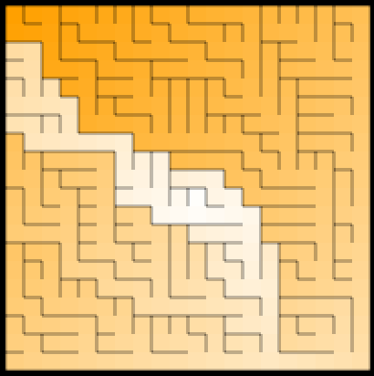
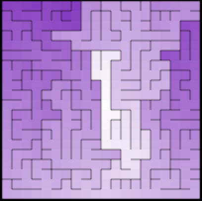

# Labyrinth

Mazes For Programmers in Rust

## Binary Tree Algorithm

## Sidewinder Algorithm

## Djikstra Solutions

## Colored Solutions

Darkness of color depicts distance from center square(the farther the darker).
This lets us see, quite clearly, the structure of the maze. We’re shining Dijkstra-flavored X-rays at it and seeing what’s inside. It turns out that this works great for letting us visually compare all kinds of different maze algorithms.
For example, the first labyrinth was generated using binary tree algorithm and second using sidewinder algorithm.

