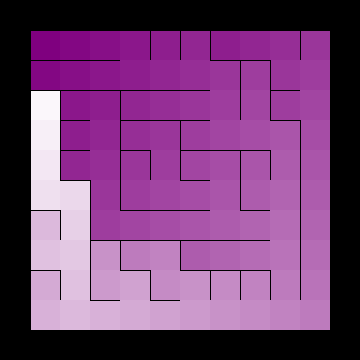
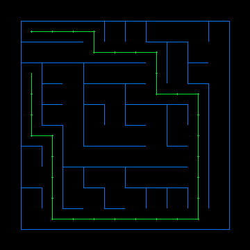
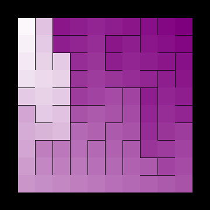
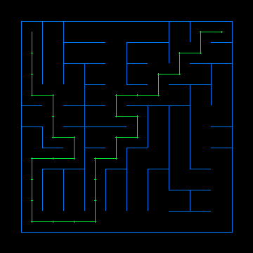
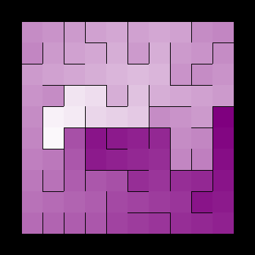
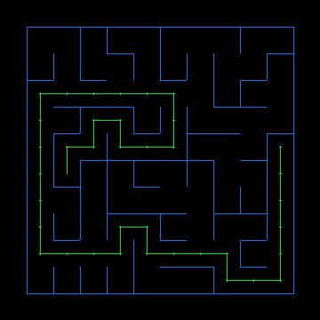
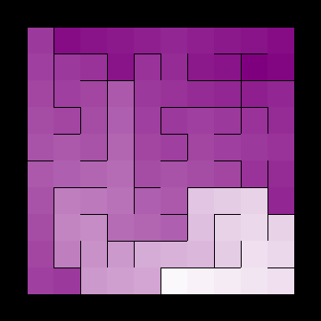
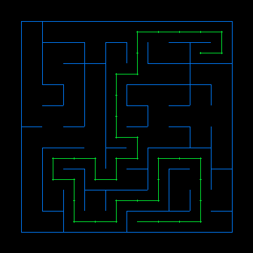

# Labyrinth

Mazes For Programmers in Rust

## Colored Solutions

Darkness of color depicts distance from a starting square(the farther the darker).
This lets us see, quite clearly, the structure of the maze. We’re shining Dijkstra-flavored X-rays at it and seeing what’s inside. It turns out that this works great for letting us visually compare all kinds of different maze algorithms.

## Binary Tree Algorithm

Starting from the north-west corner, we randomly choose either to move south or east. When we cant move east, we move south and when we cant move south we move east. This leads to a corridor in the southern and easter wall. 

## Sidewinder Algorithm

Here on every starting from northwest, we flip a coin. If heads we carve east else we halt, select a cell from current carved path and open up cell to north. Then we start from the next cell from the halted cell. 

## Aldous Broder Algorithm

In Aldous Broder Algorithm we randomly hop from cell to neighbour cell and create a path through them(in not already present).
A time taking algo, but lacks bias.

## Wilson Algorithm

The algorithm starts by choosing a point on the grid—any point—and marking it visited. Then it chooses any unvisited cell in the grid and does one of these loop-erased random walks until it encounters a visited cell. At that point it adds the path it followed to the maze, marking as visited each of the cells along that path, and then it goes again. The process repeats until all the cells in the grid have been visited.

Unbaised like Aldous Broder but focuses on visited cells rather than unvisited cells.

