# Labyrinth

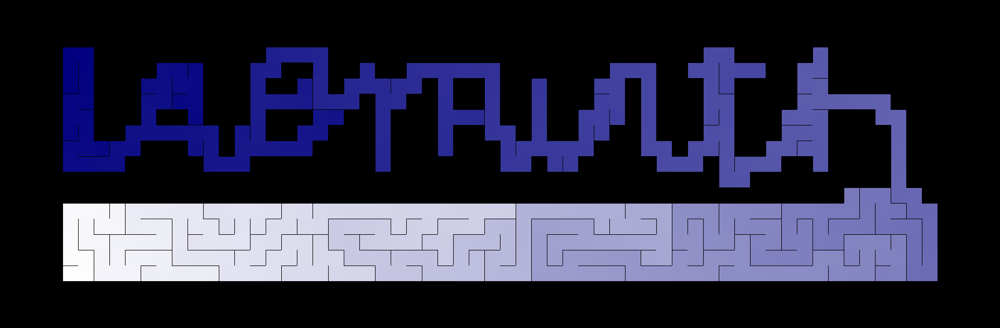


Rust implementation of the algorithms in  [Mazes For Programmers](http://www.mazesforprogrammers.com/)

## Colored Solutions

Darkness of color depicts distance from a starting square(the farther the darker).
This lets us see, quite clearly, the structure of the maze. We’re shining Dijkstra-flavored X-rays at it and seeing what’s inside. It turns out that this works great for letting us visually compare all kinds of different maze algorithms.

## Binary Tree Algorithm

Starting from the north-west corner, we randomly choose either to move south or east. When we cant move east, we move south and when we cant move south we move east. This leads to a corridor in the southern and easter wall. 

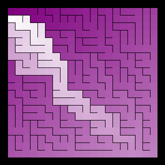
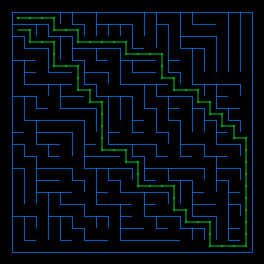
> showing the longest path in a binary tree maze

## Sidewinder Algorithm

Here on every starting from northwest, we flip a coin. If heads we carve east else we halt, select a cell from current carved path and open up cell to north. Then we start from the next cell from the halted cell. 

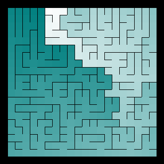

> showing the longest path in a sidewinder maze

## Aldous Broder Algorithm

In Aldous Broder Algorithm we randomly hop from cell to neighbour cell and create a path through them(in not already present).
A time taking algo, but lacks bias.

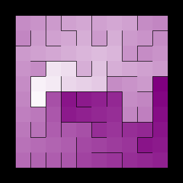
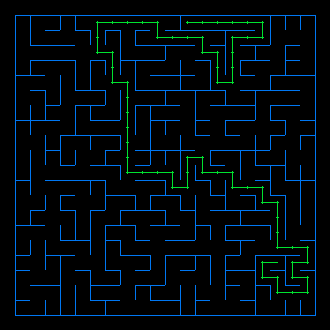
> showing the longest path in a aldous broder maze

## Wilson Algorithm

The algorithm starts by choosing a point on the grid—any point—and marking it visited. Then it chooses any unvisited cell in the grid and does one of these loop-erased random walks until it encounters a visited cell. At that point it adds the path it followed to the maze, marking as visited each of the cells along that path, and then it goes again. The process repeats until all the cells in the grid have been visited.

Unbaised like Aldous Broder but focuses on visited cells rather than unvisited cells.

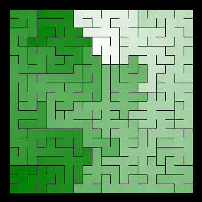
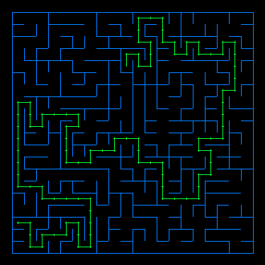
> showing the longest path in a wilson maze

## Hunt And Kill Algorithm

We start randomly from any cell, then traverse to unvisited neighbour. When we run out of unvisited neighbour, we randomly choose an unvisited cell that neighbours the visited cell and make path between those. Then we repeat the method untill all cells are visited.

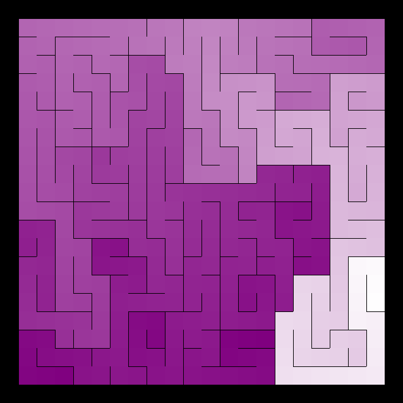
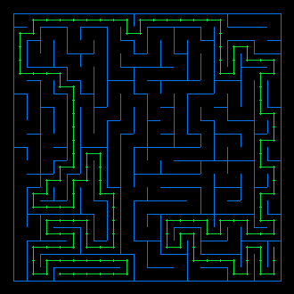
> showing the longest path in a hunt and kill maze

## Recursive Backtracking

Same as Hunt and Kill, but on finding no unvisited neighbour, we backtrack the visited cells until we find one with unvisited neighbour.

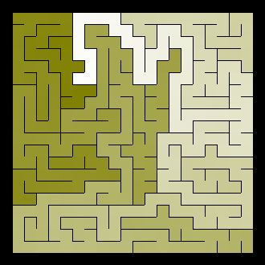
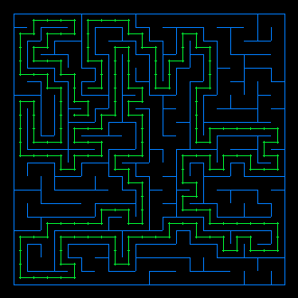
> showing the longest path in a recursive backtracking maze

## Masking
We can create a text/image file where some cells are inactive. And when we run an algorithm on it
mazes are made by ignoring the cells

### Text Masking
```
    ......................
    ..........XX..........
    .........XXXX.........
    ........XXXXXX........
    .......XXXXXXXX.......
    ......XXXX..XXXX......
    .....XXXXX..XXXXX.....
    ....XXXXXX..XXXXXX....
    ...XXXX........XXXX...
    ..XX..............XX..
    ......................
    ..XX..............XX..
    ...XXXX........XXXX...
    ....XXXXXX..XXXXXX....
    .....XXXXX..XXXXX.....
    ......XXXX..XXXX......
    .......XXXXXXXX.......
    ........XXXXXX........
    .........XXXX.........
    ..........XX..........
    ......................
```

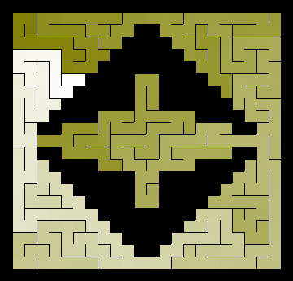

### Image Masking

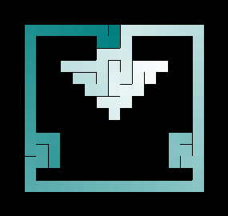